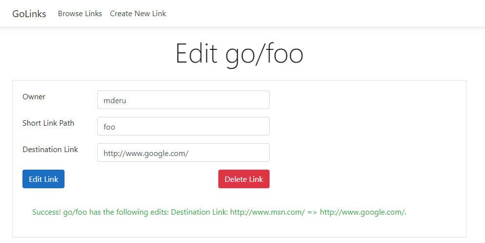

# Go Links

## Overview

This project is yet another implementation of an internal link shortener, with
some modest variations on typical link shorteners. As the name suggests, it is
modeled after Google's Go Links, and is pretty similar to
[golinks.io](golinks.io), minus the fancy analytics features.

Note that this project does not contain any tools for making DNS resolve this
website using only `go/`, you'll need to handle achieving this on your own.

Ask your doctor if Go Links is right for you. If you don't need to share these
links with other users, consider using a Browser plugin instead. IT's a more
appropriately sized hammer that gets the job done. Alternatively, you can use
[Chromium's Custom Search Engine feature](https://www.groovypost.com/howto/add-custom-search-engine-chrome/)
to add common links, as well as support query strings.

## Creating new links

Visit `Create New Link` at the top of the page, or the path `/Links/New`. Then,
fill out the Owner, Short Link Path, and Destination Link fields and press
"Create Link". More details on special query handling syntax can be found on
that page. You can also hover over the fields to see more information on their
usage.

You can also make a `POST` request to `/Links/New` with the following values:

* `LinkRequest.Owner`
* `LinkRequest.ShortLink`
* `LinkRequest.DestinationLink`

## Browse existing links

Sometimes, you want to know what other handy shortcuts your teammates have
made, or you want to find a link you created in the past but forgot the name
of it. You can browse existing links by visiting the "Browse Links" tab in
the nav bar, or by visiting the path `/Links/Browse`.

From here, you can also choose to edit or delete the link. Currently, there
is no restriction to who can delete the link. I've found that teammates are
usually pretty good about not fighting over a link, and it is difficult to
manage links from teammates that have left the company.

It's an honor system for now, but the goal is to have some sort of paper trail
to who deleted the link, and to notify owners that the link has been updated.

## Editing links

Links are also editable by clicking the Edit button from the Browse page, or by
visiting the path `Links/Edit/View/<id>`, where `<id>` is the ID of the link.
Currently, it is not possible to edit a link by only knowing the shortlink
name.

